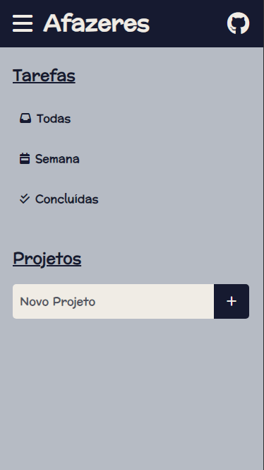
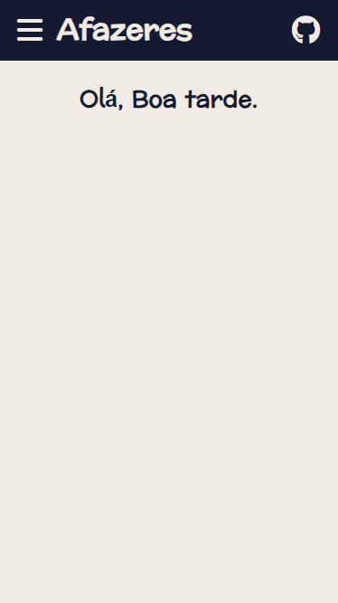
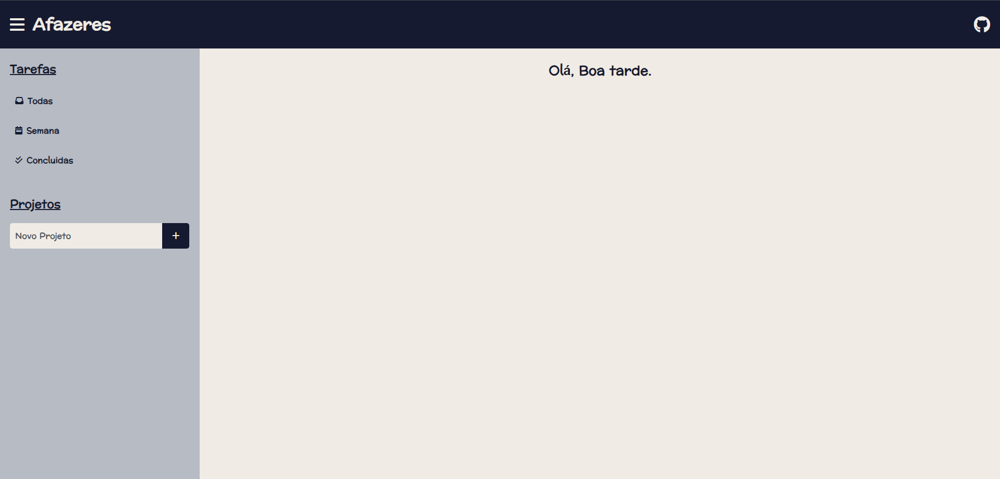
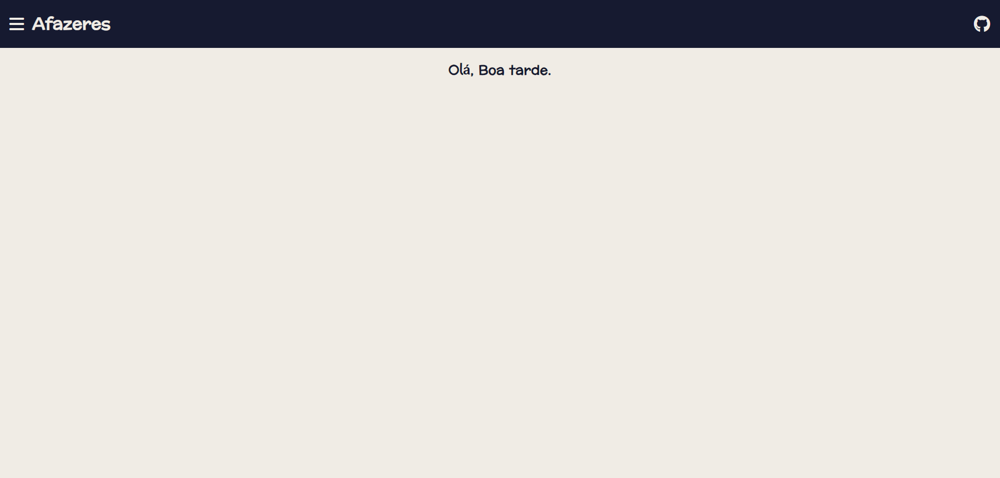

# Crie Projetos
Ao criar um projeto, quando clicado em cima do mesmo, será exibido um botão para adicionar novas tarefas para esse projeto.

# Menu
Ao lado esquerdo fica o menu para navegar entre as tarefas, como: Todas as acumuladas; As da semana; E quais já foram concluídas.

Esse menu pode ser fechado e aberto apertando no botão de menu ao lado do titúlo "Afazeres".

# Design Responsivo

### Mobile
 
### Desktop

